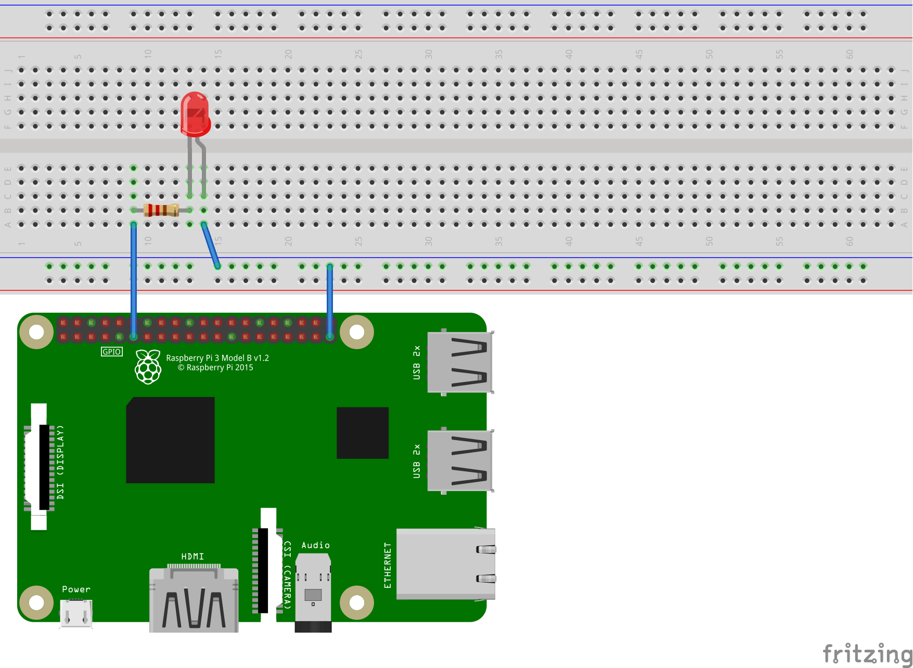

# ASP.NET Core 3.0 "Hello, blinky"

This is sample project to demonstrate [how to control build "Hello, blinky" IoT application on ASP.NET Core](https://gunnarpeipman.com/aspnet/aspnet-core-hello-blinky/). 

## Wiring

Example here uses same wiring as .NET Core IoT Libraries LED blink sample.

## Support materials

* [Blink an LED with .NET Core on a Raspberry Pi (.NET Core IoT Libraries)](https://github.com/dotnet/iot/tree/master/samples/led-blink)
* [Installing ASP.NET Core 3.0 on RaspberryPi and Windows 10 IoT Core (Gunnar Peipman)](https://gunnarpeipman.com/iot/aspnet-core-3-on-windows-10-iot-core/)
* [Building ASP.NET Core “Hello, blinky” IoT application  (Gunnar Peipman)](https://gunnarpeipman.com/aspnet/aspnet-core-hello-blinky/)
